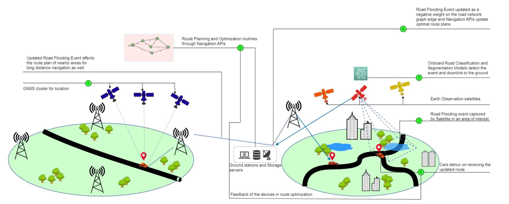
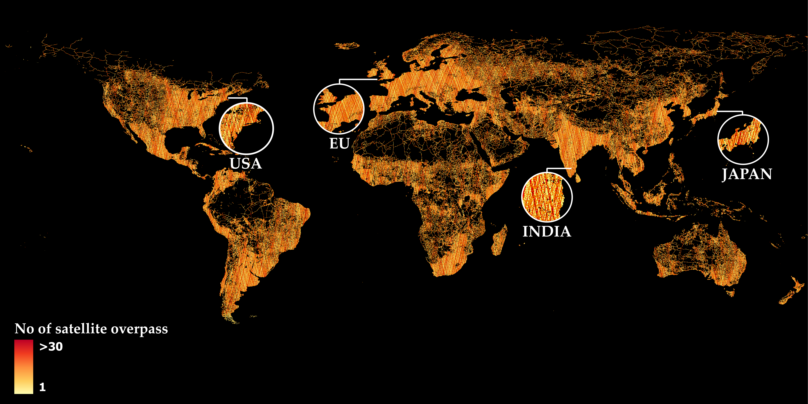

# Orbital-AI-Phisat-2-skyserve
Onboard detection dataset model and artefacts. 

This is shown as point 1 in the figure below. Consider a scenario where a road segment lying on the predicted route is flooded and as shown as point 2. Following this, a CubeSat from a satellite constellation with onboard computing capabilities acquires a multispectral image of the entire city.
A road health classification model (in this case, a water segmentation model) identifies the flooded segment as a water mask and downlinks the georeferenced mask to the ground as illustrated in Point 3 in the figure below. The geo-referenced locations of flooded road segments which are intersected with road networks from existing basemaps. This timestamped intersection location information is updated in the road network graph weights used by the navigation API service provider. Based on this, the navigation API updates an optimal route plan to the destination avoiding the flooded road segment as shown in Points 5 and 6.

## Instructions
1. Get dataset for training in the current directory with this [download link](https://zenodo.org/records/10890137) with dataset reading material [here](https://zenodo.org/records/10890137/files/Dataset_Description.pdf?download=1).
2. Run the training notebook for training different model versions [here](SkyServe_Hosted_Notebook_Orbital_AI_challenge_PhiSat_2.ipynb). Make sure that local address of the dataset is right.
3. Jetson run scripts: The optimized tflite model for testing inference runtimes is hosted [here](oai-jetson-testrun). Setup the environment with the requirements file [here](oai-jetson-testrun\requirements.txt). You can run the `test_run.py` script for the same. 
4. Satellite simulation scripts: The satellite groundtrack simulations against the road density datasets can be found [here](). Unzip the road density [image](satellite_simulation_road_density\grip4_area_land_km2_georeference.zip) in the same folder. Update your spacetrack username and password in the [main file](satellite_simulation_road_density\main.py). Run main.py to generate the revisit images. 

# Simulation results
Ground track simulation results for satellite-nadir views over road segments

